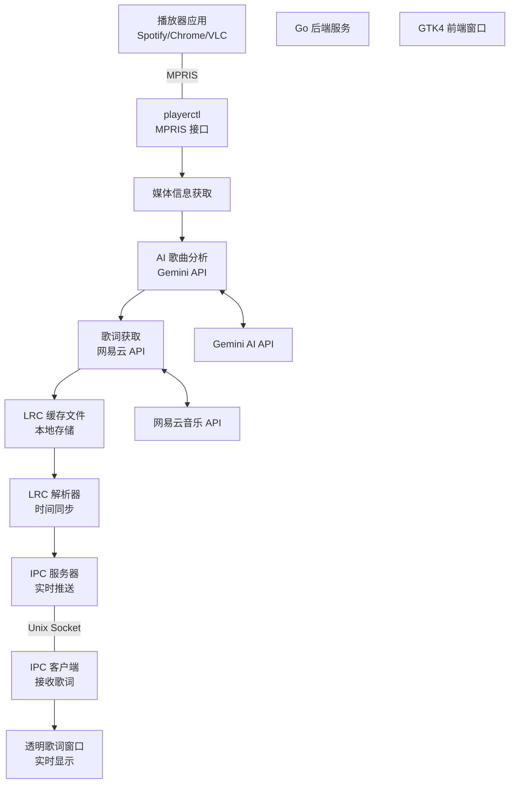

# 智能歌词显示系统

一个基于 Hyprland 的实时歌词显示系统，能够自动获取当前播放的媒体信息，通过 AI 分析判断是否为歌曲，然后获取歌词并在透明窗口中实时显示。

## 📋 目录

- [系统架构](#系统架构)
- [工作流程](#工作流程)
- [技术栈](#技术栈)
- [快速开始](#快速开始)
- [详细配置](#详细配置)
- [项目结构](#项目结构)
- [Hyprland 集成](#hyprland-集成)
- [常见问题](#常见问题)
- [开发说明](#开发说明)

## 🏗️ 系统架构



### 🔄 数据流向说明

1. **媒体监听** → 播放器通过 MPRIS 标准暴露媒体信息
2. **信息获取** → playerctl 获取当前播放的媒体标题和艺术家
3. **AI 分析** → Gemini AI 判断是否为歌曲并提取标准化信息
4. **歌词获取** → 通过网易云 API 搜索并下载歌词
5. **本地缓存** → 歌词保存为 LRC 文件，避免重复下载
6. **解析同步** → 解析 LRC 时间戳，实现毫秒级同步
7. **实时推送** → 通过 IPC 将当前歌词行推送给前端
8. **界面显示** → GTK4 透明窗口实时显示歌词

## 🔄 工作流程

### 1. 媒体信息获取
- 使用 `playerctl` 监听当前播放的媒体信息
- 获取媒体标题、艺术家等元数据
- 支持所有符合 MPRIS 标准的播放器 (Spotify, Chrome, Firefox, VLC 等)

### 2. AI 歌曲分析
- 将媒体标题发送给 Gemini AI 进行分析
- AI 判断是否为歌曲类型的媒体
- 提取标准化的歌曲名和歌手信息
- 过滤掉非音乐内容 (视频、播客等)

### 3. 歌词获取与缓存
- 使用网易云音乐 API 搜索歌词
- 支持多种歌词格式 (LRC 带时间戳格式)
- 自动缓存歌词文件到本地 `lyrics_cache/` 目录
- 避免重复下载，提高响应速度

### 4. LRC 歌词解析
- 解析 LRC 格式的时间戳和歌词内容
- 支持毫秒级精度的时间同步
- 处理歌词的特殊格式和编码

### 5. 实时推送与显示
- 通过 Unix Domain Socket (IPC) 实时推送当前歌词行
- GTK4 透明窗口接收歌词并实时更新显示
- 支持自动重连和错误恢复

## 🛠️ 技术栈

### 后端 (Go)
- **playerctl**: 媒体播放器控制和信息获取
- **Gemini AI API**: 智能歌曲识别和信息提取
- **网易云音乐 API**: 歌词数据源
- **Unix Domain Socket**: 高性能 IPC 通信
- **zerolog**: 结构化日志记录

### 前端 (C++/GTK4)
- **GTK4**: 现代 UI 框架
- **透明窗口**: 无干扰的歌词覆盖显示
- **CSS 样式**: 美观的歌词外观
- **自动重连**: 稳定的后端连接

### 系统集成
- **Hyprland**: Wayland 合成器支持
- **MPRIS**: 媒体播放器标准接口
- **systemd**: 可选的服务管理

## 🚀 快速开始

### 1. 安装依赖
```bash
# 一键安装所有依赖
./install-deps.sh

# 或者手动安装
sudo pacman -S go gtk4 pkg-config playerctl  # Arch Linux
sudo apt install golang-go libgtk-4-dev pkg-config playerctl  # Ubuntu/Debian
```

### 2. 配置 API 密钥
```bash
# 设置 Gemini AI API 密钥
export GEMINI_API_KEY="your_gemini_api_key_here"

# 或者在配置文件中设置
echo 'GEMINI_API_KEY=your_api_key' > .env
```

### 3. 编译项目
```bash
# 编译后端和前端
make all

# 或者单独编译
make backend  # 只编译 Go 后端
make gui      # 只编译 GTK4 前端
```

### 4. 运行系统
```bash
# 启动后端服务 (在后台运行)
make run-backend &

# 启动 GUI 客户端 (透明窗口模式)
make run-gui

# 或者控制台模式 (用于调试)
make run-gui-console
```

### 5. 安装到系统 (可选)
```bash
# 系统安装 (需要 sudo 权限，安装到 /usr/local/bin)
sudo make install

# 用户安装 (推荐，安装到 ~/.local/bin)
make install-user

# 确保 ~/.local/bin 在 PATH 中 (仅用户安装需要)
echo 'export PATH="$HOME/.local/bin:$PATH"' >> ~/.bashrc
source ~/.bashrc  # 或重新打开终端

# 安装后可以在任何地方运行
lyrics-backend &     # 启动后端
lyrics-gui          # 启动GUI
lyrics-gui -c       # 控制台模式
```

### 6. 卸载 (如果需要)
```bash
# 卸载系统安装
sudo make uninstall

# 卸载用户安装
make uninstall-user
```

## ⚙️ 详细配置

### 环境变量
```bash
# Gemini AI 配置
export GEMINI_API_KEY="your_gemini_api_key"
export GEMINI_MODEL="gemini-2.5-flash"  # 可选，默认 gemini-pro
export ENTEASE_COOKIE="" # 可选 网易云cookie,避免限流

# 日志级别
export LOG_LEVEL="info"  # debug, info, warn, error

# IPC 配置
export SOCKET_PATH="/tmp/lyrics_app.sock"  # 可选，默认路径

# 缓存目录
export LYRICS_CACHE_DIR="./lyrics_cache"  # 可选，默认 ~/.cache/lyrics
```

### 配置文件说明
- 后端配置通过环境变量管理
- 支持 `.env` 文件加载环境变量
- 歌词缓存自动管理，无需手动配置

## 📁 项目结构

```
lyrics/
├── go-backend/                 # Go 后端服务
│   ├── cmd/lyrics-backend/     # 主程序入口
│   │   ├── main.go            # 后端主程序
│   │   └── lyrics_cache/      # 歌词缓存目录
│   ├── internal/               # 内部包
│   │   ├── app/               # 应用程序核心逻辑
│   │   ├── config/            # 配置管理
│   │   ├── ipc/               # IPC 服务器
│   │   ├── lyrics/            # 歌词处理和 LRC 解析
│   │   └── player/            # 播放器接口 (playerctl)
│   └── pkg/                   # 外部包
│       ├── ai/                # AI 客户端 (Gemini)
│       └── tencent/           # 网易云音乐 API
│
├── cpp-gui/                   # C++ GTK4 前端
│   └── main.cpp              # GUI 主程序和 IPC 客户端
│
├── build/                     # 编译输出目录
│   ├── lyrics-backend         # Go 后端可执行文件
│   └── lyrics-gui             # C++ 前端可执行文件
│
├── lyrics_cache/             # 全局歌词缓存目录 (或 ~/.cache/lyrics/)
├── Makefile                  # 构建和运行脚本
├── simple_ipc_reader.sh     # IPC 测试工具
├── ipc_reader.sh            # IPC 调试工具
├── install-deps.sh          # 依赖安装脚本
├── README.md                # 主要文档 (本文件)
└── README-GUI.md            # GUI 详细说明

# 安装后的系统文件位置:
# /usr/local/bin/lyrics-backend    # 系统安装 (sudo make install)
# /usr/local/bin/lyrics-gui        # 系统安装 (sudo make install)
# ~/.local/bin/lyrics-backend      # 用户安装 (make install-user)
# ~/.local/bin/lyrics-gui          # 用户安装 (make install-user)
# ~/.cache/lyrics/                 # 用户歌词缓存目录
```

## 🖥️ Hyprland 集成

### 1. 窗口规则配置
在 `~/.config/hypr/hyprland.conf` 中添加：

```bash
# 歌词窗口规则 - 使用应用程序类名
windowrulev2 = float, class:^(lyrics-gui)$
windowrulev2 = pin, class:^(lyrics-gui)$
windowrulev2 = stayfocused, class:^(lyrics-gui)$
windowrulev2 = noborder, class:^(lyrics-gui)$
windowrulev2 = noshadow, class:^(lyrics-gui)$
windowrulev2 = noblur, class:^(lyrics-gui)$

# 可选：设置歌词窗口位置和大小
windowrulev2 = move 10% 80%, class:^(lyrics-gui)$
windowrulev2 = size 80% 120, class:^(lyrics-gui)$

# 备用规则 - 使用窗口标题
windowrulev2 = float, title:^(Lyrics Overlay)$
windowrulev2 = pin, title:^(Lyrics Overlay)$
```

### 2. 自动启动
```bash
# 方法一：使用本地安装路径 (开发环境)
exec-once = cd /path/to/lyrics && make run-backend
exec-once = sleep 2 && cd /path/to/lyrics && make run-gui

# 方法二：使用已安装的二进制文件 (推荐)
exec-once = lyrics-backend
exec-once = sleep 2 && lyrics-gui
```

### 3. 快捷键绑定
```bash
# 方法一：使用本地路径 (开发环境)
# 切换歌词显示
bind = SUPER, L, exec, pkill lyrics-gui || (cd /path/to/lyrics && make run-gui)

# 重启歌词服务
bind = SUPER SHIFT, L, exec, pkill lyrics-backend && sleep 1 && (cd /path/to/lyrics && make run-backend)

# 重启整个歌词系统
bind = SUPER CTRL, L, exec, pkill lyrics-backend; pkill lyrics-gui; sleep 1; cd /path/to/lyrics && make run-backend && sleep 2 && make run-gui

# 方法二：使用已安装的二进制文件 (推荐)
# 切换歌词显示
bind = SUPER, L, exec, pkill lyrics-gui || lyrics-gui

# 重启歌词服务
bind = SUPER SHIFT, L, exec, pkill lyrics-backend && sleep 1 && lyrics-backend

# 重启整个歌词系统
bind = SUPER CTRL, L, exec, pkill lyrics-backend; pkill lyrics-gui; sleep 1; lyrics-backend & sleep 2 && lyrics-gui
```

## 🐛 常见问题

### Q: 歌词窗口不显示或显示异常
A: 检查以下几点：
1. 确保 GTK4 正确安装：`pkg-config --modversion gtk4`
2. 检查 Wayland 环境变量：`echo $WAYLAND_DISPLAY`
3. 查看日志输出：运行 `make run-gui-console` 查看详细日志

### Q: 无法连接到后端服务
A: 检查后端服务状态：
```bash
# 检查后端是否运行
ps aux | grep lyrics-backend

# 检查 IPC socket 文件
ls -la /tmp/lyrics_app.sock

# 手动启动后端并查看日志
make run-backend
```

### Q: Gemini AI 无法响应
A: 验证 API 配置：
```bash
# 检查 API 密钥
echo $GEMINI_API_KEY

# 测试网络连接
curl -H "x-goog-api-key: $GEMINI_API_KEY" \
  "https://generativelanguage.googleapis.com/v1beta/models"
```

### Q: 获取不到歌词
A: 检查播放器和网络：
```bash
# 测试 playerctl
playerctl metadata title

# 检查网络连接
curl -I "https://music.163.com"

# 查看缓存目录
ls -la lyrics_cache/
```

## 🔧 开发说明

### 常用命令
```bash
# 编译所有组件
make all

# 运行后端 (后台)
make run-backend

# 运行 GUI (透明窗口)
make run-gui

# 运行 GUI (控制台模式，用于调试)
make run-console

# 安装到系统目录 (需要 sudo)
sudo make install

# 安装到用户目录 (推荐)
make install-user

# 卸载系统安装
sudo make uninstall

# 卸载用户安装
make uninstall-user

# 清理编译文件
make clean

# 查看帮助信息
make help
```

### 调试工具
```bash
# 使用简单的 IPC 读取器测试后端
./simple_ipc_reader.sh

# 查看详细日志
LOG_LEVEL=debug make run-backend
```

### 测试环境
- 确保有音乐播放器在运行 (Spotify, Chrome 播放音乐等)
- 确保网络连接正常
- 确保 Gemini API 密钥有效

### 验证安装
```bash
# 检查依赖
pkg-config --modversion gtk4
playerctl --version
go version

# 检查窗口类名 (运行 GUI 后)
hyprctl clients | grep -A 5 "lyrics"

# 测试 IPC 连接
./simple_ipc_reader.sh
```

### 系统要求
- **操作系统**: Linux (推荐 Arch Linux)
- **桌面环境**: Hyprland (Wayland)
- **Go 版本**: >= 1.19
- **GTK 版本**: GTK4
- **网络**: 需要访问 Google Gemini API 和网易云音乐 API

## 📝 许可证

本项目采用 MIT 许可证。

## 🤝 贡献

欢迎提交 Issue 和 Pull Request！

### 贡献指南
1. Fork 本项目
2. 创建特性分支 (`git checkout -b feature/amazing-feature`)
3. 提交更改 (`git commit -m 'Add some amazing feature'`)
4. 推送到分支 (`git push origin feature/amazing-feature`)
5. 开启 Pull Request

### 开发环境设置
```bash
# 克隆项目
git clone <repository-url>
cd lyrics

# 安装依赖
./install-deps.sh

# 设置 API 密钥
export GEMINI_API_KEY="your_api_key_here"

# 编译项目
make all

# 安装到用户目录 (推荐)
make install-user

# 运行测试
make test  # 如果有测试的话
```

## 📞 支持

如果您遇到问题或有建议，请：
1. 查看 [常见问题](#常见问题) 部分
2. 检查现有的 [Issues](../../issues)
3. 创建新的 Issue 并详细描述您的问题

### 报告 Bug
请在 Issue 中包含以下信息：
- 操作系统和版本
- Hyprland 版本
- 错误日志或截图
- 重现步骤

### 功能请求
欢迎提出新功能建议！请描述：
- 功能的用途和价值
- 预期的行为
- 可能的实现方案

---

**享受您的智能歌词体验！** 🎵

*如果这个项目对您有帮助，请考虑给个 ⭐ Star！*
