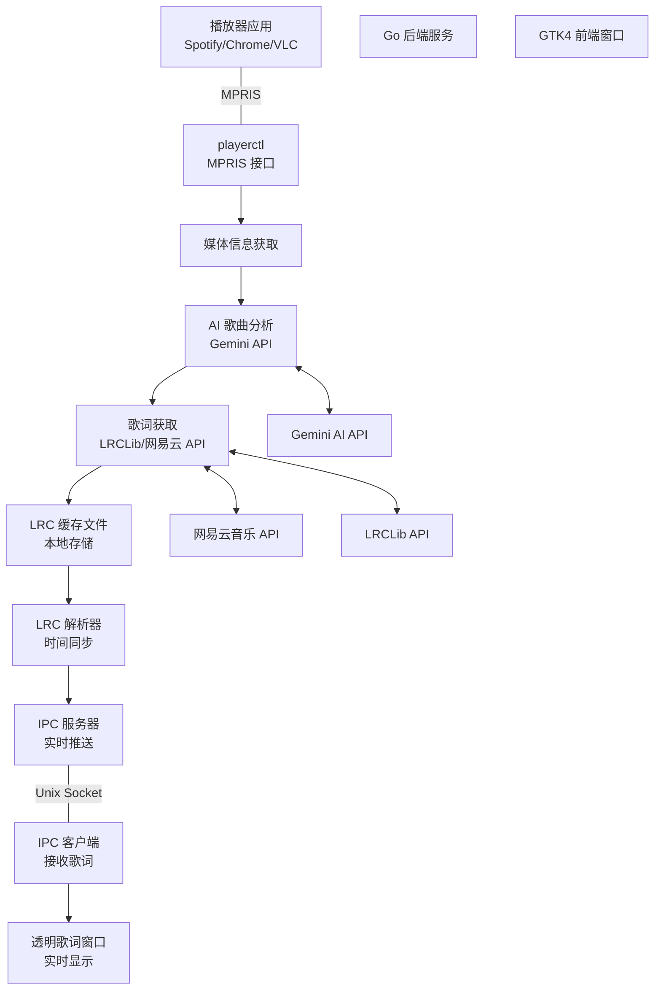

# 智能歌词显示系统

一个基于 Hyprland 的实时歌词显示系统，能够自动获取当前播放的媒体信息，通过 AI 分析判断是否为歌曲，然后获取歌词并在透明窗口中实时显示。


## 🚀 快速开始

**新用户推荐**: 查看 [快速开始指南](QUICK_START.md) - 5分钟快速上手！

## 📋 目录

- [快速开始](QUICK_START.md) ⭐ **推荐新用户**
- [系统架构](#系统架构)
- [工作流程](#工作流程)
- [技术栈](#技术栈)
- [详细配置](#详细配置)
- [项目结构](#项目结构)
- [Hyprland 集成](#hyprland-集成)
- [Waybar 集成](#waybar-集成)
- [常见问题](#常见问题)
- [开发说明](#开发说明)

## 🏗️ 系统架构



### 🔄 数据流向说明

1. **媒体监听** → 播放器通过 MPRIS 标准暴露媒体信息
2. **信息获取** → playerctl 获取当前播放的媒体标题和艺术家
3. **AI 分析** → Gemini AI 判断是否为歌曲并提取标准化信息
4. **歌词获取** → 通过网易云 API 搜索并下载歌词
5. **本地缓存** → 歌词保存为 LRC 文件，避免重复下载
6. **解析同步** → 解析 LRC 时间戳，实现毫秒级同步
7. **实时推送** → 通过 IPC 将当前歌词行推送给前端
8. **界面显示** → GTK4 透明窗口实时显示歌词

## 🔄 工作流程

### 1. 媒体信息获取
- 使用 `playerctl` 监听当前播放的媒体信息
- 获取媒体标题、艺术家等元数据
- 支持所有符合 MPRIS 标准的播放器 (Spotify, Chrome, Firefox, VLC 等)

### 2. AI 歌曲分析
- 将媒体标题发送给 Gemini AI 进行分析
- AI 判断是否为歌曲类型的媒体
- 提取标准化的歌曲名和歌手信息
- 过滤掉非音乐内容 (视频、播客等)

### 3. 歌词获取与缓存
- 使用通用音乐API接口支持多个音乐平台
- 优先使用LRCLib API，提供高质量的LRC歌词
- 次级使用网易云音乐API，支持自动故障转移
- 未来可扩展支持QQ音乐、酷狗音乐等平台
- 支持多种歌词格式 (LRC 带时间戳格式)
- 自动缓存歌词文件到本地 `lyrics_cache/` 目录
- 避免重复下载，提高响应速度
- 智能歌词匹配算法，基于标题、艺术家和歌曲时长

### 4. LRC 歌词解析
- 解析 LRC 格式的时间戳和歌词内容
- 支持毫秒级精度的时间同步
- 处理歌词的特殊格式和编码

### 5. 实时推送与显示
- 通过 Unix Domain Socket (IPC) 实时推送当前歌词行
- GTK4 透明窗口接收歌词并实时更新显示
- 支持自动重连和错误恢复

## 🛠️ 技术栈

### 后端 (Go)
- **playerctl**: 媒体播放器控制和信息获取
- **Gemini AI API**: 智能歌曲识别和信息提取
- **音乐API管理器**: 支持多个音乐平台的统一接口
- **网易云音乐 API**: 主要歌词数据源
- **QQ音乐 API**: 备选歌词数据源（开发中）
- **Unix Domain Socket**: 高性能 IPC 通信
- **zerolog**: 结构化日志记录

### 前端 (C++/GTK4)
- **GTK4**: 现代 UI 框架
- **透明窗口**: 无干扰的歌词覆盖显示
- **CSS 样式**: 美观的歌词外观
- **自动重连**: 稳定的后端连接

### 系统集成
- **Hyprland**: Wayland 合成器支持
- **MPRIS**: 媒体播放器标准接口
- **systemd**: 可选的服务管理

## 🚀 快速开始

### 1. 安装依赖
```bash
# 一键安装所有依赖
./install-deps.sh

# 或者手动安装
sudo pacman -S go gtk4 pkg-config playerctl socat  # Arch Linux
sudo apt install golang-go libgtk-4-dev pkg-config playerctl socat  # Ubuntu/Debian
sudo dnf install golang gtk4-devel pkgconf-pkg-config playerctl socat  # Fedora
```

### 2. 配置应用

#### 创建配置文件
```bash
# 创建配置目录
mkdir -p ~/.config/lyrics

# 复制示例配置文件
cp config.toml.example ~/.config/lyrics/config.toml

# 编辑配置文件
nano ~/.config/lyrics/config.toml
```

#### 设置 API 密钥
在配置文件中设置您的 Gemini API 密钥：
```toml
[ai]
module_name = "gemini"
api_key = "your_gemini_api_key_here"
```

#### 如何获取 Gemini API 密钥

1. 访问 [Google AI Studio](https://makersuite.google.com/app/apikey)
2. 登录 Google 账号
3. 点击 "Create API Key"
4. 复制生成的 API 密钥
5. 将密钥添加到配置文件中

### 3. 编译项目
```bash
# 编译后端和前端
make all

# 或者单独编译
make backend  # 只编译 Go 后端
make gui      # 只编译 GTK4 前端
```

### 4. 运行系统
```bash
# 启动后端服务 (在后台运行)
make run-backend &

# 启动 GUI 客户端 (透明窗口模式)
make run-gui

# 或者控制台模式 (用于调试)
make run-gui-console
```

### 5. 安装到系统 (可选)
```bash
# 系统安装 (需要 sudo 权限，安装到 /usr/local/bin)
sudo make install

# 用户安装 (推荐，安装到 ~/.local/bin)
make install-user

# 确保 ~/.local/bin 在 PATH 中 (仅用户安装需要)
echo 'export PATH="$HOME/.local/bin:$PATH"' >> ~/.bashrc
source ~/.bashrc  # 或重新打开终端

# 安装后可以在任何地方运行
lyrics-backend &     # 启动后端
lyrics-gui          # 启动GUI
lyrics-gui -c       # 控制台模式
```

### 6. 卸载 (如果需要)
```bash
# 卸载系统安装
sudo make uninstall

# 卸载用户安装
make uninstall-user
```

## ⚙️ 详细配置

### 配置文件路径

应用使用 TOML 格式的配置文件，按以下优先级查找配置：

1. **XDG 配置目录**: `$XDG_CONFIG_HOME/lyrics/config.toml`
2. **用户配置目录**: `~/.config/lyrics/config.toml` (推荐)
3. **当前目录**: `config.toml` (回退选项)

### 配置文件格式

**完整配置示例 (`~/.config/lyrics/config.toml`)**：
```toml
[app]
# Unix socket path for IPC communication
socket_path = "/tmp/lyrics_app.sock"

# Check interval for media status (支持格式: "5s", "10s", "1m")
check_interval = "5s"

# Lyrics cache directory (留空使用默认路径)
cache_dir = ""

[ai]
# AI module: "gemini" or "openai"
module_name = "gemini"

# API key for the selected AI service
api_key = "your_api_key_here"

# Base URL for OpenAI-compatible APIs (仅在使用 OpenAI 时需要)
base_url = ""
```

### 配置选项说明

#### [app] 部分

| 配置项 | 描述 | 默认值 | 示例 |
|--------|------|--------|------|
| `socket_path` | IPC 通信的 Unix socket 路径 | `/tmp/lyrics_app.sock` | `/tmp/lyrics_app.sock` |
| `check_interval` | 媒体状态检查间隔 | `5s` | `"5s"`, `"10s"`, `"1m"` |
| `cache_dir` | 歌词缓存目录 | `~/.cache/lyrics` | `"/path/to/cache"` |

#### [ai] 部分

| 配置项 | 描述 | 可选值 | 示例 |
|--------|------|--------|------|
| `module_name` | AI 服务提供商模块名 | `gemini`（所有Gemini系列模型）, `openai` | `"gemini"` |
| `api_key` | AI 服务的 API 密钥 | - | `"AIzaSyA..."` |
| `base_url` | OpenAI 兼容 API 的基础 URL | - | `"https://api.openai.com/v1"` |

**注意**: 对于所有 Gemini 系列模型（如 gemini-pro, gemini-2.5-flash 等），都使用 `module_name = "gemini"`。

### 不同 AI 服务的配置示例

#### Gemini AI (推荐)
```toml
[ai]
module_name = "gemini"  # 适用于所有Gemini系列模型
api_key = "AIzaSyA..."  # 从 https://makersuite.google.com/app/apikey 获取
```

**支持的Gemini模型**: gemini-pro, gemini-2.5-flash, gemini-1.5-pro 等所有Gemini系列模型都使用相同的配置。

#### OpenAI
```toml
[ai]
module_name = "openai"
api_key = "sk-..."      # 从 https://platform.openai.com/api-keys 获取
base_url = ""           # 使用官方 API，留空即可
```

#### 自托管 OpenAI 兼容 API
```toml
[ai]
module_name = "openai"
api_key = "your_custom_key"
base_url = "https://your-api-endpoint.com/v1"
```

### 配置验证

启动应用时会显示配置加载状态：

```bash
./build/lyrics-backend
# 输出示例:
# INFO: Loaded config from /home/user/.config/lyrics/config.toml
# INFO: Cache directory: /home/user/.cache/lyrics
# INFO: Using AI module: gemini
```

如果配置文件不存在，会显示：
```bash
# INFO: Config file not found at /home/user/.config/lyrics/config.toml, using defaults
# WARNING: No AI API key configured in config.toml.
```
# 2024/12/19 10:30:00 [INFO] Socket path: /tmp/lyrics_app.sock
# 2024/12/19 10:30:00 [INFO] Starting lyrics app...
```

#### 检查配置是否正确
```bash
# 查看应用启动日志
./build/lyrics-backend | head -10

# 检查配置文件是否存在
ls -la ~/.config/lyrics/config.toml
```

#### 常见配置问题

**问题 1: API 密钥未设置**
```
错误: No AI API key configured in config.toml
解决: 在 ~/.config/lyrics/config.toml 中设置正确的 ai.api_key
```

**问题 2: 配置文件格式错误**
```
错误: Failed to load config file
解决: 检查 config.toml 文件格式，确保 TOML 语法正确
```

**问题 3: 缓存目录权限问题**
```bash
# 检查缓存目录权限
ls -ld ~/.cache/lyrics

# 如果目录不存在或权限不足，重新创建
rm -rf ~/.cache/lyrics
mkdir -p ~/.cache/lyrics
chmod 755 ~/.cache/lyrics
```

**问题 4: Socket 文件权限问题**
```bash
# 清理旧的 socket 文件
rm -f /tmp/lyrics_app.sock

# 检查 /tmp 目录权限
ls -ld /tmp
```

#### 配置优先级说明

配置加载顺序 (后者覆盖前者)：
```
1. 默认值
2. ~/.lyrics.env (用户全局配置)
3. .env.local (本地开发配置)  
4. .env (项目配置)
5. 命令行环境变量 (最高优先级)
```

**示例**：
```bash
# ~/.lyrics.env
GEMINI_API_KEY=global_key
LOG_LEVEL=info

# .env
GEMINI_API_KEY=project_key
LYRICS_CACHE_DIR=/custom/cache

# 命令行
LYRICS_CACHE_DIR=/tmp/cache ./build/lyrics-backend

# 最终配置:
# GEMINI_API_KEY=project_key (来自 .env)
# LOG_LEVEL=info (来自 ~/.lyrics.env)  
# LYRICS_CACHE_DIR=/tmp/cache (来自命令行)
```

### 配置管理最佳实践

#### 配置安全
```bash
# 1. 设置配置文件权限 (仅自己可读)
chmod 600 ~/.lyrics.env
chmod 600 .env

# 2. 避免在版本控制中暴露密钥
echo ".env" >> .gitignore
echo ".env.local" >> .gitignore

# 3. 使用环境变量而非硬编码
# ❌ 不推荐: 直接写在代码里
# ✅ 推荐: 使用配置文件或环境变量
```

#### 配置备份与迁移
```bash
# 备份配置到安全位置
cp ~/.lyrics.env ~/Documents/lyrics_config_backup.env

# 迁移到新环境
scp ~/.lyrics.env user@newhost:~/.lyrics.env

# 团队共享配置模板 (移除敏感信息)
cp .env .env.template
sed -i 's/=.*/=your_key_here/' .env.template
```

````markdown
## 📁 项目结构

```
lyrics/
├── go-backend/                 # Go 后端服务
│   ├── cmd/lyrics-backend/     # 主程序入口
│   │   ├── main.go            # 后端主程序
│   │   └── lyrics_cache/      # 歌词缓存目录
│   ├── internal/               # 内部包
│   │   ├── app/               # 应用程序核心逻辑
│   │   ├── config/            # 配置管理
│   │   ├── ipc/               # IPC 服务器
│   │   ├── lyrics/            # 歌词处理和 LRC 解析
│   │   └── player/            # 播放器接口 (playerctl)
│   └── pkg/                   # 外部包
│       ├── ai/                # AI 客户端 (Gemini)
│       ├── music/             # 音乐API通用接口和管理器
│       ├── netease/           # 网易云音乐 API 客户端
│       └── qqmusic/           # QQ音乐 API 客户端（模板）
│
├── cpp-gui/                   # C++ GTK4 前端
│   └── main.cpp              # GUI 主程序和 IPC 客户端
│
├── build/                     # 编译输出目录
│   ├── lyrics-backend         # Go 后端可执行文件
│   └── lyrics-gui             # C++ 前端可执行文件
│
├── lyrics_cache/             # 全局歌词缓存目录 (或 ~/.cache/lyrics/)
├── Makefile                  # 构建和运行脚本
├── simple_ipc_reader.sh     # IPC 测试工具
├── ipc_reader.sh            # IPC 调试工具
├── install-deps.sh          # 依赖安装脚本
├── check_config.sh          # 配置检查脚本
├── README.md                # 主要文档 (本文件)
├── README-GUI.md            # GUI 详细说明
└── MUSIC_API_REFACTORING.md # 音乐API重构说明

# 安装后的系统文件位置:
# /usr/local/bin/lyrics-backend    # 系统安装 (sudo make install)
# /usr/local/bin/lyrics-gui        # 系统安装 (sudo make install)
# ~/.local/bin/lyrics-backend      # 用户安装 (make install-user)
# ~/.local/bin/lyrics-gui          # 用户安装 (make install-user)
# ~/.cache/lyrics/                 # 用户歌词缓存目录
```

## 🖥️ Hyprland 集成

### 1. 窗口规则配置
在 `~/.config/hypr/hyprland.conf` 中添加：

```bash
# 歌词窗口规则 - 使用应用程序类名
windowrulev2 = float, class:^(lyrics-gui)$
windowrulev2 = pin, class:^(lyrics-gui)$
windowrulev2 = stayfocused, class:^(lyrics-gui)$
windowrulev2 = noborder, class:^(lyrics-gui)$
windowrulev2 = noshadow, class:^(lyrics-gui)$
windowrulev2 = noblur, class:^(lyrics-gui)$

# 可选：设置歌词窗口位置和大小
windowrulev2 = move 10% 80%, class:^(lyrics-gui)$
windowrulev2 = size 80% 120, class:^(lyrics-gui)$

# 备用规则 - 使用窗口标题
windowrulev2 = float, title:^(Lyrics Overlay)$
windowrulev2 = pin, title:^(Lyrics Overlay)$
```

### 2. 自动启动
```bash
# 方法一：使用本地安装路径 (开发环境)
exec-once = cd /path/to/lyrics && make run-backend
exec-once = sleep 2 && cd /path/to/lyrics && make run-gui

# 方法二：使用已安装的二进制文件 (推荐)
exec-once = lyrics-backend
exec-once = sleep 2 && lyrics-gui
```

### 3. 快捷键绑定
```bash
# 方法一：使用本地路径 (开发环境)
# 切换歌词显示
bind = SUPER, L, exec, pkill lyrics-gui || (cd /path/to/lyrics && make run-gui)

# 重启歌词服务
bind = SUPER SHIFT, L, exec, pkill lyrics-backend && sleep 1 && (cd /path/to/lyrics && make run-backend)

# 重启整个歌词系统
bind = SUPER CTRL, L, exec, pkill lyrics-backend; pkill lyrics-gui; sleep 1; cd /path/to/lyrics && make run-backend && sleep 2 && make run-gui

# 方法二：使用已安装的二进制文件 (推荐)
# 切换歌词显示
bind = SUPER, L, exec, pkill lyrics-gui || lyrics-gui

# 重启歌词服务
bind = SUPER SHIFT, L, exec, pkill lyrics-backend && sleep 1 && lyrics-backend

# 重启整个歌词系统
bind = SUPER CTRL, L, exec, pkill lyrics-backend; pkill lyrics-gui; sleep 1; lyrics-backend & sleep 2 && lyrics-gui
```

## 📊 Waybar 集成

系统支持集成到 Waybar 状态栏，以紧凑的方式显示当前歌词。

### 1. 准备脚本文件

首先复制歌词脚本到合适位置：

```bash
# 复制脚本到用户 bin 目录
cp waybar_lyrics.sh ~/.local/bin/
chmod +x ~/.local/bin/waybar_lyrics.sh

# 或者复制到系统 bin 目录
sudo cp waybar_lyrics.sh /usr/local/bin/
sudo chmod +x /usr/local/bin/waybar_lyrics.sh
```

### 2. Waybar 配置

在 `~/.config/waybar/config` 中添加歌词模块：

```json
{
    "modules-left": ["hyprland/workspaces"],
    "modules-center": ["custom/lyrics"],
    "modules-right": ["clock", "tray"],
    
    "custom/lyrics": {
        "format": "{}",
        "exec": "~/.local/bin/waybar_lyrics.sh",
        "interval": 1,
        "return-type": "text",
        "on-click": "lyrics-gui",
        "on-click-right": "notify-send '歌词提示' '点击左键打开歌词窗口'",
        "tooltip": true,
        "tooltip-format": "当前歌词: {}"
    }
}
```

### 3. Waybar 样式配置

在 `~/.config/waybar/style.css` 中自定义歌词样式：

```css
/* 歌词模块样式 */
#custom-lyrics {
    background: linear-gradient(
        to right,
        rgba(51, 204, 255, 0.6),
        rgba(0, 255, 153, 0.7)
    );
    color: white;
    padding: 4px 8px;
    font-size: 14px;
    border-radius: 10px;
    font-weight: bold;
    margin: 0 5px;
    min-width: 200px;
    text-align: center;
}

#custom-lyrics:hover {
    background: linear-gradient(
        to right,
        rgba(51, 204, 255, 0.8),
        rgba(0, 255, 153, 0.9)
    );
}
```

### 4. 功能特性

#### 基本功能
- **实时显示**: 每秒通过 IPC 获取最新歌词
- **长度限制**: 自动截取前50个字符，避免状态栏溢出
- **点击交互**: 左键点击启动歌词窗口
- **工具提示**: 鼠标悬停显示完整歌词内容
- **连接状态**: 未连接时显示音乐图标

#### 高级配置选项

```json
"custom/lyrics": {
    "format": "{}",
    "exec": "~/.local/bin/waybar_lyrics.sh",
    "interval": 1,
    "return-type": "text",
    "on-click": "lyrics-gui",
    "on-click-right": "pkill lyrics-gui",
    "on-click-middle": "pkill lyrics-backend; lyrics-backend &",
    "tooltip": true,
    "tooltip-format": "{}",
    "max-length": 60,
    "escape": true
}
```

#### 自定义脚本选项

您可以修改 `waybar_lyrics.sh` 脚本来自定义显示：

```bash
#!/bin/bash
# 自定义版本示例
LYRICS=$(timeout 0.01 socat UNIX-CONNECT:/tmp/lyrics_app.sock STDOUT 2>/dev/null | tail -n 1)

if [ -n "$LYRICS" ] && [ "$LYRICS" != "Waiting for lyrics..." ]; then
    # 更长的显示长度
    if [ ${#LYRICS} -gt 80 ]; then
        echo "🎵 ${LYRICS:0:77}..."
    else
        echo "🎵 $LYRICS"
    fi
else
    # 不同的无歌词状态显示
    echo "🎵 暂无歌词"
fi
```

### 5. 数据流向说明

#### 新的数据流向
```
播放器 → lyrics-backend → IPC Socket → waybar_lyrics.sh → Waybar 显示
```

#### 优势对比
| 方案 | 延迟 | 准确性 | 资源占用 | 可靠性 |
|------|------|--------|----------|--------|
| 文件读取 | 高 | 中 | 低 | 中 |
| IPC 直连 | 低 | 高 | 中 | 高 |

#### 脚本工作原理
1. 使用 `socat` 连接到后端 IPC socket
2. 设置短超时避免阻塞 Waybar
3. 获取最新的歌词行
4. 格式化输出，限制长度
5. 处理无歌词状态

### 6. 故障排除

#### 常见问题

**问题 1: Waybar 显示空白**
```bash
# 测试脚本是否工作
~/.local/bin/waybar_lyrics.sh

# 检查 socat 是否安装
which socat || sudo pacman -S socat

# 检查后端是否运行
ps aux | grep lyrics-backend
```

**问题 2: 脚本权限问题**
```bash
# 确保脚本可执行
chmod +x ~/.local/bin/waybar_lyrics.sh

# 检查脚本路径
ls -la ~/.local/bin/waybar_lyrics.sh
```

**问题 3: IPC 连接失败**
```bash
# 测试 IPC 连接
echo "" | socat UNIX-CONNECT:/tmp/lyrics_app.sock STDOUT

# 检查 socket 文件
ls -la /tmp/lyrics_app.sock
```

**问题 4: 中文字符截取异常**
脚本已使用字符级别截取，如遇问题可使用字节级别：
```bash
# 在脚本中替换截取方式
echo "♪ $(echo "$LYRICS" | head -c 100)..."
```

### 7. 性能优化

#### 减少资源占用
```json
// 降低更新频率
"interval": 2,  // 2秒更新一次

// 或使用信号触发模式（需要后端支持）
"signal": 10,
"interval": "once"
```

#### 脚本优化
```bash
#!/bin/bash
# 优化版本 - 减少子进程调用
exec 3< <(timeout 0.01 socat UNIX-CONNECT:/tmp/lyrics_app.sock STDOUT 2>/dev/null)
read -u 3 LYRICS
exec 3<&-

[ -n "$LYRICS" ] && [ "$LYRICS" != "Waiting for lyrics..." ] && 
    echo "♪ ${LYRICS:0:47}" || echo "♪"
```

### 8. 最佳实践

#### 推荐配置
```json
"custom/lyrics": {
    "format": "{}",
    "exec": "~/.local/bin/waybar_lyrics.sh",
    "interval": 1,
    "return-type": "text",
    "on-click": "lyrics-gui",
    "tooltip": true,
    "max-length": 60
}
```

#### 集成建议
- 将脚本放在 `~/.local/bin/` 目录
- 设置合理的更新间隔（1-2秒）
- 配置点击交互增强用户体验
- 使用工具提示显示完整信息

这样配置后，Waybar 将通过 IPC 直接获取歌词，提供更快的响应速度和更准确的同步。

## 🐛 常见问题

### Q: 歌词窗口不显示或显示异常
A: 检查以下几点：
1. 确保 GTK4 正确安装：`pkg-config --modversion gtk4`
2. 检查 Wayland 环境变量：`echo $WAYLAND_DISPLAY`
3. 查看日志输出：运行 `make run-gui-console` 查看详细日志

### Q: 无法连接到后端服务
A: 检查后端服务状态：
```bash
# 检查后端是否运行
ps aux | grep lyrics-backend

# 检查 IPC socket 文件
ls -la /tmp/lyrics_app.sock

# 手动启动后端并查看日志
make run-backend
```

### Q: Gemini AI 无法响应
A: 验证 API 配置：
```bash
# 检查 API 密钥
echo $GEMINI_API_KEY

# 测试网络连接
curl -H "x-goog-api-key: $GEMINI_API_KEY" \
  "https://generativelanguage.googleapis.com/v1beta/models"
```

### Q: 获取不到歌词
A: 检查播放器和网络：
```bash
# 测试 playerctl
playerctl metadata title

# 检查网络连接
curl -I "https://music.163.com"

# 查看缓存目录
ls -la lyrics_cache/
```

## 🔧 开发说明

### 常用命令
```bash
# 编译所有组件
make all

# 运行后端 (后台)
make run-backend

# 运行 GUI (透明窗口)
make run-gui

# 运行 GUI (控制台模式，用于调试)
make run-console

# 安装到系统目录 (需要 sudo)
sudo make install

# 安装到用户目录 (推荐)
make install-user

# 卸载系统安装
sudo make uninstall

# 卸载用户安装
make uninstall-user

# 清理编译文件
make clean

# 查看帮助信息
make help
```

### 调试工具
```bash
# 使用简单的 IPC 读取器测试后端
./simple_ipc_reader.sh

# 查看详细日志
LOG_LEVEL=debug make run-backend
```

### 测试环境
- 确保有音乐播放器在运行 (Spotify, Chrome 播音乐等)
- 确保网络连接正常
- 确保 Gemini API 密钥有效

### 验证安装
```bash
# 检查依赖
pkg-config --modversion gtk4
playerctl --version
go version

# 检查窗口类名 (运行 GUI 后)
hyprctl clients | grep -A 5 "lyrics"

# 测试 IPC 连接
./simple_ipc_reader.sh
```

### 系统要求
- **操作系统**: Linux (推荐 Arch Linux)
- **桌面环境**: Hyprland (Wayland)
- **Go 版本**: >= 1.19
- **GTK 版本**: GTK4
- **网络**: 需要访问 Google Gemini API 和网易云音乐 API

## 📝 许可证

本项目采用 MIT 许可证。

## 🤝 贡献

欢迎提交 Issue 和 Pull Request！

### 贡献指南
1. Fork 本项目
2. 创建特性分支 (`git checkout -b feature/amazing-feature`)
3. 提交更改 (`git commit -m 'Add some amazing feature'`)
4. 推送到分支 (`git push origin feature/amazing-feature`)
5. 开启 Pull Request

### 开发环境设置
```bash
# 克隆项目
git clone <repository-url>
cd lyrics

# 安装依赖
./install-deps.sh

# 设置配置文件
mkdir -p ~/.config/lyrics
cp config.toml.example ~/.config/lyrics/config.toml
# 编辑配置文件，设置 AI API 密钥

# 编译项目
make all

# 安装到用户目录 (推荐)
make install-user

# 运行测试
make test  # 如果有测试的话
```

## 📞 支持

如果您遇到问题或有建议，请：
1. 查看 [常见问题](#常见问题) 部分
2. 检查现有的 [Issues](../../issues)
3. 创建新的 Issue 并详细描述您的问题

### 报告 Bug
请在 Issue 中包含以下信息：
- 操作系统和版本
- Hyprland 版本
- 错误日志或截图
- 重现步骤

### 功能请求
欢迎提出新功能建议！请描述：
- 功能的用途和价值
- 预期的行为
- 可能的实现方案

---

**享受您的智能歌词体验！** 🎵

## 📚 相关文档

- [音乐API重构说明](MUSIC_API_REFACTORING.md)
- [LRCLib歌词源集成](LRCLIB_INTEGRATION.md)
- [README-GUI说明](README-GUI.md)

*如果这个项目对您有帮助，请考虑给个 ⭐ Star！*
